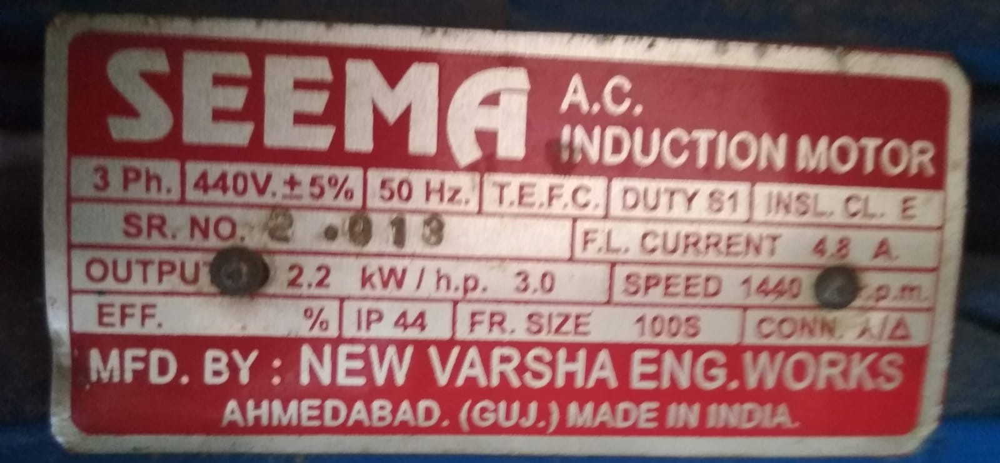

# 📓 Extrusion Pro information
| Specification    |     |
|----------|-------------|
| 📓 Type   |     Single Screw   |
| 💎 Version   |     1.0   |
| 💰 Price new material in INDIA |  +/- 75,000 ₹  |
| ⚖️ Weight (inc frame) |   110 kg   |
| 📦 Dimension   | 1500 x 600 x 1550 mm|
| ⚙️ Power (W) | 5 kW|
| 🔌 Voltage | 230V|
| ⚡️ AMP | 16A|
| ♻️ Input Flake Size  | Small  |
| 🔩 Screw diameter | 30mm|
| 🔩 Length of screw (mm) | 790 mm |
| 🔩 Effective screw length | 600 mm |
| 🔩 Rated Motor Power | 2.2 kW |
| ⚙️ Motor Type   |    (check the build section for more details)   |
| - Rated Motor output Torque |  ~110 Nm |
| - Rated Motor output speed |   192 RPM   |
| - Max. Motor and Inverter power   | 2.2 kW|
| - Recommended motor shaft   | 30 mm|
| - Heating zones   | 3 |
| - Heating power: max.   | 2 kW|

# 🌐 3D Model

<iframe width="500" height="600" src="https://b2b.partcommunity.com/community/partcloud/embedded.html?route=embedded-viewer&name=Extrusion+Molding+machine&model_id=118643&portal=b2b&noAutoload=true&autoRotate=false&hideMenu=false&topColor=%23dde7ed&bottomColor=%23ffffff&cameraParams=false&varsettransfer=" frameborder="0" id="EmbeddedView-Iframe-118643" allowfullscreen></iframe>

# 🛠 Machinery & skills that used    
Build Extrusion Pro  | Machines needed | Skills needed
--- | ---| ---
  | - Lathe   - Drill press  - Milling machine   - Welding machine (TIG or MIG/MAG recommended)   - Torq wrench| - Welding (advanced)   - Machining (advanced)   - Assembling (intermediate)  - Electronics (intermediate)

# 🔩 Materials and parts

### Motor selection & Gearbox         
- This extrusion machine requires torque of ~120Nm, although selected motor of 2.2Kw can generate 14.7Nm torque at full load with the 4.8amp. We attached 7.5:1 ratios gearbox that directly increases the output torque at the hub. with the gearbox output torque is ~110Nm.     

### Selection of Variable Frequency Drive(VFD)      
- we used VFD to control the speed of motor and get smooth starting, we used __VFD022EL21A__ model of Delta VFD that is 1Ph to 3Ph VFD means it can works on single phase input to control 3Ph motor.      

# 🌦 Pros & cons

### Pros

The extruder is one of the fastest and most efficient to melt plastic among Precious Plastic machines. It is a safe and reliable machine amongst our machine’s family!

The Extruder Pro screw is designed to work with multiple types of plastics. Which  will make you capable of working with different kind of plastic in small batches. Also this machine is conceived to be much more polyvalent than other industrial machines, allowing you to extrude into moulds, shapes, different nozzles…

### Cons

This machine requires a higher skill set of machining amongst Precious Plastic machines. It also requires a large motor and a specialized screw that make it a relatively expensive machine compare to other Precious Plastic machines.

### ⚠️ Make sure the extruder is up to temperature before starting the motor!
 
| Plastic Type | Feeding Zone (C°) | Barrel Zone (C°) | Nozzle Zone (C°) |
|--------------|-------------------|------------------|------------------|
| PP           | 190               | 200              | 200              |
| PS           | 200               | 210              | 210              |
| HDPE         | 190               | 200              | 200              |
| LDPE         | 190               | 200              | 200              |

Some examples of extruded beams:

# Run and Maintain the Extrusion Pro
Hooray! You build yourself an Extruder Pro! Let's have some fun and make some beams and bricks. Below we explain how to do this, which temperatures to use, how the workflow should be, plus the practical things to take in account like maintenance.

## 🏃‍♀️ Extrude some Plastic

### How to Start

1. Turn on the main switch
2. Select the desired temperature on the 3 PIDs
3. Pour the plastic inside the hopper
4. Wait until you reach the desired temperature (around 15/20 min)
5. Put your mask / put ventilation on
6. Turn on the motor at slow speed to check for plastic flow
7. <i>(optional)</i> If you change the material from the previous session, you need to clean the barrel from old plastics by letting it run until the old plastic is replaced by the new one.
8. The machine is now ready for production.

### Production

1. If a mould is required for the desired product, attach it to the nozzle
2. The flow can be adjusted by increasing or decreasing the speed on the VFD (0 to 50/60HZ)
3. You can start and press run on the VFD
4. Keep enough plastic flakes in the hopper while extruding to reduce chances of bubbles in the extruded plastic.

# 👌 Tips & tricks while using

Before setting up your mold, check the nozzle to see if the plastic looks homogeneous, fluid and check the viscosity and color.

If you change plastic let the machine run for a minute to make sure the barrel is clean from the previous plastic type.

Shredded flakes smaller than 7 mm and rounded feed through the hopper very well. Longer and thinner flakes tend to stay stuck in the hopper. You can either granulate them to smaller grains or install a hopper vibrator to improve the feeding. Plastic granules generally allow for better feeding.

No plastic exiting the nozzle and abnormally high temperature readings means that a lot of friction is happening in the barrel and that the pressure is rising. Immediately shut off the machine as there is probably a clog somewhere preventing the plastic to flow out.

### ⚠️ Always be careful and use suitable gloves when handling hot plastic!

Make sure there is always plenty of plastic in the hopper. you can hear a high-pitched squeak noise or metal on metal rubbing sounds if the barrel is empty. In that case, refill the hopper of stop extrusion to prevent excess wear.

# ⏳ Maintain

The extruder is a simple and robust machine. However, if you wish to keep it for a long time, we will now give you a few maintenance tips for your machine:

### Bearing lubrication

Make sure there is plenty of grease in the bearing housing. You can add a little grease with the greasing nozzle every month to make sure they are always well lubricated.

### Gear box lubrification

Depending on the type, the gear unit can be lubricated with grease or oil. Each gear unit is equipped with a lubrication plate. Check and follow the maintenance instructions from your motor and gearbox supplier.

### Barrel maintenance

Your barrel is made out of mild steel, and designed to be easy to build. You’ll want to avoid rust from getting on the inner part of the barrel. Letting the plastic cool down inside the barrel will prevent rust in the barrel. If you don’t use it for a long time, you can add a little silicon oil after having emptied plastic from the barrel to avoid rust. The screw is hardened and expected to last longer then the barrel. Make a new barrel if required.

